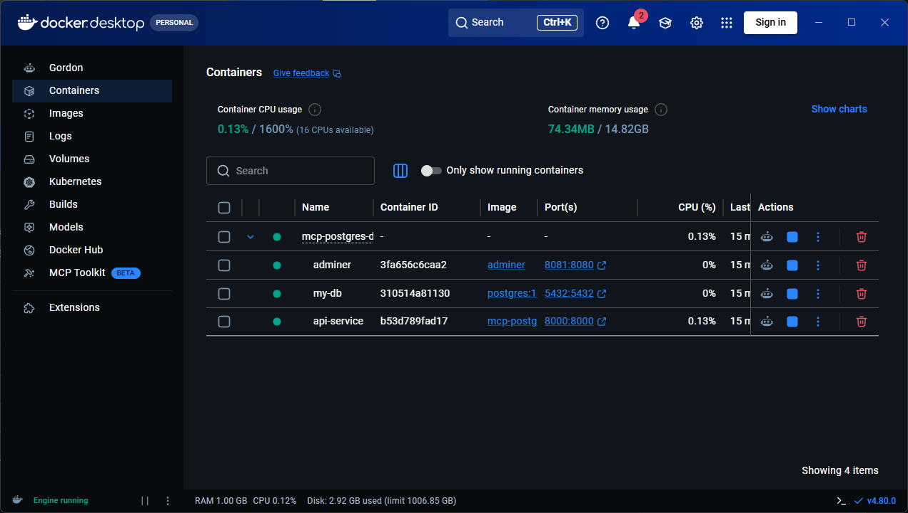
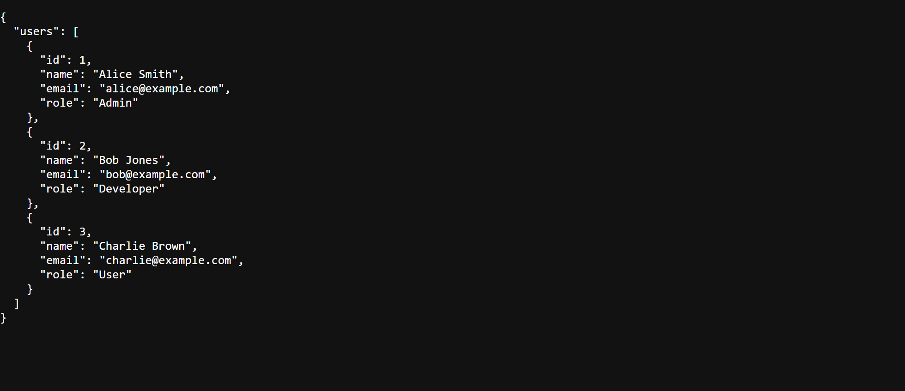
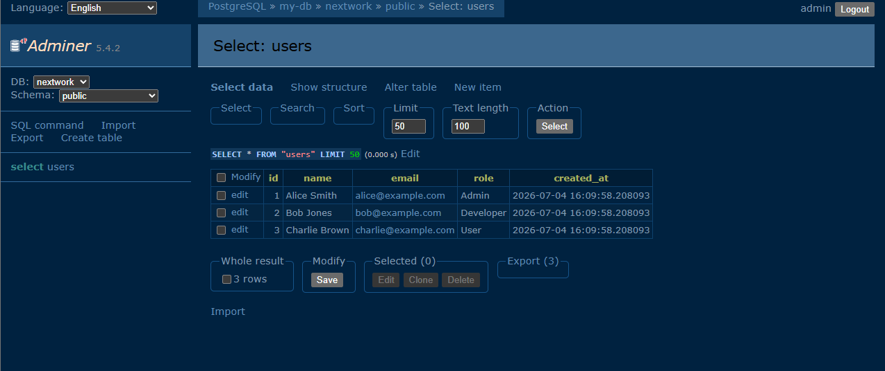

# AI-Managed PostgreSQL Infrastructure with Docker, FastAPI & MCP

This project showcases an advanced DevOps and AI engineering workflow. By utilizing the **Model Context Protocol (MCP)**, the AI-powered **Cursor** code editor was connected directly to local system processes, allowing an AI assistant to provision, manage, and monitor a multi-container database ecosystem.

To transform this from a simple configuration into a robust portfolio project, the system was expanded into a **fully containerized three-tier web application architecture** incorporating:
- **Automated Database Seeding:** Instant table schema creation and mockup data generation on container startup.
- **Microservice API Layer:** A custom-built **FastAPI** REST interface, fully containerized and communicating over a private Docker network bridge.
- **Production-Grade Isolation:** Secure configuration management using environment variables to keep sensitive database passwords out of git tracking.

---

## System Architecture & Workflow

1. **AI Controller (Cursor & MCP):** Controls local system engines to build and run containerized software.
2. **Database Tier (PostgreSQL v15):** The core database service configured with local volume mounts. An `init.sql` script mounts into `/docker-entrypoint-initdb.d/` to run automatic seeding.
3. **Application API Tier (FastAPI):** A custom Python container running an asynchronous REST API to safely interface with PostgreSQL.
4. **Administration Tier (Adminer):** A web console providing complete graphical management over database relations.
5. **Environment Isolation (.env):** Keeps production environment secrets secure and strictly local.

---

## Repository Structure

```plaintext
├── images/                 # Saved screenshots demonstrating system success
│   ├── docker-running.png
│   ├── api-response.png
│   └── adminer-gui.png
├── .venv/                  # Local isolated Python virtual environment (ignored by Git)
├── .gitignore              # Keeps credentials and massive libraries off GitHub
├── .env.example            # Deployment template showing required variable keys
├── app.py                  # FastAPI REST API serving database records as JSON
├── Dockerfile              # Instructions for building your custom Python API image
├── docker-compose.yml      # Orchestrates the database, API service, and Adminer
├── init.sql                # SQL initialization file for schema seeding
├── requirements.txt        # Explicit python dependency manifest
└── README.md               # Production-ready developer documentation
```

---

## Visual Verifications & Verification Demos

This section visually verifies that the multi-container architecture is operating successfully.

### 1. Multi-Container Orchestration (Docker Desktop)
Below is proof of all three containers—the database, web GUI admin dashboard, and custom FastAPI server—running simultaneously on the custom Docker network bridge.



---

### 2. FastAPI JSON Service Endpoint
The containerized FastAPI service successfully queries the internal PostgreSQL container and serves standard, serialized JSON database records directly to the local browser port.

#### Request URL:
`http://localhost:8000/users`

#### Active API Response:
```json
{
  "users": [
    {
      "id": 1,
      "name": "Alice Smith",
      "email": "alice@example.com",
      "role": "Admin"
    },
    {
      "id": 2,
      "name": "Bob Jones",
      "email": "bob@example.com",
      "role": "Developer"
    },
    {
      "id": 3,
      "name": "Charlie Brown",
      "email": "charlie@example.com",
      "role": "User"
    }
  ]
}
```



---

### 3. Database Administration Dashboard (Adminer GUI)
The Adminer service successfully mounts on port `8081` and allows secure visual query inspections of the seeded `users` table directly inside the internal container network.



---

## Getting Started (Local Run Guide)

### Prerequisites

- [Docker Desktop](https://www.docker.com/products/docker-desktop) installed and active on your system.
- [Python 3.12+](https://www.python.org/) installed locally.
- [uv](https://github.com/astral-sh/uv) (a high-speed Python package manager).

### Setup Instructions

1. **Clone the Repository:**
   ```bash
   git clone https://github.com/srahman14/mcp-postgres-docker.git
   cd mcp-postgres-docker
   ```

2. **Configure Environment Secrets:**
   Create a local configuration file named `.env` in the root folder (do not commit this file to Git):
   ```plaintext
   DB_NAME=nextwork
   DB_USER=admin
   DB_PASSWORD=your_super_secure_password_here
   ```

3. **Spin Up the Containers:**
   Compile the custom Python image and start the full multi-container stack in one step:
   ```powershell
   docker compose up --build -d
   ```
   *Docker Compose automatically reads variables from the local `.env` file, mounts the `init.sql` script to seed the database, builds your custom API service, and connects them together.*

4. **Verify Your Running Infrastructure:**
   - **Interactive API Documentation:** Open your browser and navigate to `http://localhost:8000/docs` to test endpoints visually.
   - **JSON Endpoints:** Visit `http://localhost:8000/users` to view your live, container-served PostgreSQL database records.
   - **Admin Panel GUI:** Log in to `http://localhost:8081` with your credentials to manage records visually.

---

## Skills Demonstrated in This Project

- **Model Context Protocol (MCP):** Configuring and utilizing local AI communication channels to safely execute native command processes.
- **Docker Orchestration & DevOps:** Crafting custom multi-container environments and configuring local host port forwarding mapping.
- **Dockerfile Engineering:** Writing optimized, multi-stage instruction recipes to compile secure, lightweight application containers from scratch.
- **Automation & Seeding:** Building automatic database seed mechanisms using Docker entry point script pipelines.
- **Security Best Practices:** Working with environment variable schemas to completely eliminate security vulnerabilities and password exposures.
- **Python Database Integration:** Connecting external runtimes directly to isolated container networks using standard production library drivers.
